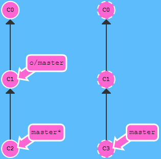
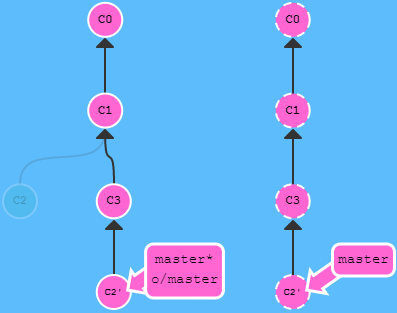
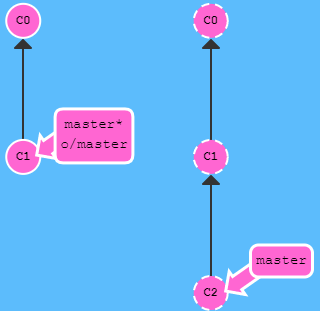
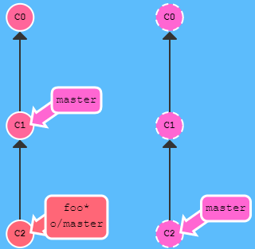
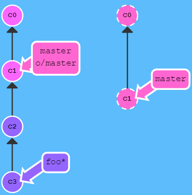

# 主要

## 1. 基础篇

循序渐进地介绍 Git 主要命令。

### 1.1 Git commit

Git 仓库中的**提交记录保存的是**你的目录下所有**文件的快照**，就像是把整个目录复制，然后再粘贴一样，但比复制粘贴优雅许多！

Git 希望提交记录尽可能地**轻量**，因此在你每次进行提交时，它并**不会盲目地复制整个目录**。**条件允许的情况下**，它会**将当前版本与仓库中的上一个版本进行对比，并把所有的差异打包到一起作为一个提交记录**。

Git 还保存了提交的历史记录。这也是为什么大多数提交记录的上面都有父节点的原因 —— 我们会在图示中用箭头来表示这种关系。对于项目组的成员来说，维护提交历史对大家都有好处。

关于提交记录太深入的东西咱们就不再继续探讨了，现在你可以**把提交记录看作是项目的快照**。提交记录非常轻量，可以快速地在这些提交记录之间切换！

### 1.2 Git branch

创建一个到名为 `newImage` 的分支：

```shell
git branch newImage
```

想要切换到`<name>`分支上：

```shell
git checkout <name>
```

创建一个新的分支同时切换到新创建的分支：

```shell
git checkout -b <your-branch-name>
```

### 1.3 Git merge

接下来咱们看看如何将两个分支合并到一起。就是说我们新建一个分支，在其上开发某个新功能，开发完成后再合并回主线。

咱们先来看一下第一种方法 —— `git merge`。在 Git 中合并两个分支时会产生一个特殊的提交记录，它有两个父节点。翻译成自然语言相当于：“我要把这两个父节点本身及它们所有的祖先都包含进来。”


把 `bugFix` 合并到 `master` 里：

```shell
git merge bugFix
```


`master` 现在指向了一个拥有两个父节点的提交记录。假如从 `master` 开始沿着箭头向上看，在到达起点的路上会经过所有的提交记录。这意味着 `master` 包含了对代码库的所有修改。

在master分支时合并 bugFix 分支，即`git merge bugFix`，此时得到合并后的代码，若再切换到 bugFix 分支，去合并master，即`git merge master`，那么当前的 bugFix 的HEAD会移动到当前master的HEAD位置（即fast-forward）。下面就进行该过程：

把 `master` 分支合并到 `bugFix`：

```shell
git checkout bugFix; git merge master
```


### 1.4 Git rebase

第二种合并分支的方法是 `git rebase`。Rebase 实际上就是取出一系列的提交记录，“复制”它们，然后在另外一个地方逐个的放下去。

Rebase 的优势就是可以创造更线性的提交历史，这听上去有些难以理解。如果只允许使用 Rebase 的话，代码库的提交历史将会变得异常清晰。


现在要把上图 bugFix 分支里的工作直接移到 master 分支上。移动以后会使得两个分支的功能看起来像是按顺序开发，但实际上它们是并行开发的。

用 `git rebase` 实现此目标，注意现在是在 bugFix 分支上，rebase 的意思就是以后面的某个位置为base，为父节点，那么我们要以 master 为当前分支 bugFix 最后一次提交的父节点，就用下面的命令：

```shell
git rebase master
```

执行后效果如下：


现在 bugFix 分支上的工作在 master 的最顶端，同时我们也得到了一个更线性的提交序列。

注意，提交记录 C3 依然存在（树上那个半透明的节点），而 C3' 是我们 Rebase 到 master 分支上的 C3 的副本。

现在唯一的问题就是 master 还没有更新，下面咱们就来更新它。切换到 `master` 上。把它 rebase 到 `bugFix` 分支上：

```shell
git rebase bugFix
```

由于 `bugFix` 继承自 `master`，所以 Git 只是简单的把 `master` 分支的引用向前移动了一下而已。

## 2. 高级篇

要开始介绍 Git 的超棒特性了，快来吧！

**在提交树上移动**

在接触 Git 更高级功能之前，我们有必要先学习在你项目的提交树上前后移动的几种方法。

一旦熟悉了如何在 Git 提交树上移动，你驾驭其它命令的能力也将水涨船高！

> ## HEAD
>
> 我们首先看一下 “HEAD”。 HEAD 是一个对**当前检出记录的符号引用** —— 也就是**指向**你正在其基础上**进行工作的提交记录**。
>
> HEAD 总是指向**当前分支**上**最近一次**提交记录。大多数修改提交树的 Git 命令都是从改变 HEAD 的指向开始的。
>
> HEAD 通常情况下是指向分支名的（如 bugFix）。在你提交时，改变了 bugFix 的状态，这一变化通过 HEAD 变得可见。
>
> ----
>
> 如果想看 HEAD 指向，可以通过 `cat .git/HEAD` 查看， 如果 HEAD 指向的是一个引用，还可以用 `git symbolic-ref HEAD` 查看它的指向。

### 2.1 分离 HEAD

分离的 HEAD 就是让其指向了某个具体的提交记录而不是分支名。在命令执行之前的状态如下所示：

HEAD -> master -> C1

HEAD 指向 master， master 指向 C1。

```shell
git checkout C1
```

现在变成了

HEAD -> C1

### 2.2 相对引用

通过指定提交记录哈希值的方式在 Git 中移动不太方便。在实际应用时，并没有像本程序中这么漂亮的可视化提交树供你参考，所以你就不得不用 `git log` 来查查看提交记录的哈希值。

并且哈希值在真实的 Git 世界中也会更长（译者注：基于 SHA-1，共 40 位）。例如前一关的介绍中的提交记录的哈希值可能是 `fed2da64c0efc5293610bdd892f82a58e8cbc5d8`。舌头都快打结了吧...

比较令人欣慰的是，Git 对哈希的处理很智能。你只需要提供能够唯一标识提交记录的前几个字符即可。因此我可以仅输入`fed2` 而不是上面的一长串字符。

正如我前面所说，通过哈希值指定提交记录很不方便，所以 Git 引入了相对引用。这个就很厉害了!

使用相对引用的话，你就可以从一个易于记忆的地方（比如 `bugFix` 分支或 `HEAD`）开始计算。

相对引用非常给力，这里我介绍两个简单的用法：

- 使用 `^` 向上移动 1 个提交记录
- 使用 `~<num>` 向上移动多个提交记录，如 `~3`

#### 2.2.1 操作符^

首先看看操作符 (^)。把这个符号加在引用名称的后面，表示让 Git 寻找指定提交记录的父提交。

所以 `master^` 相当于“`master` 的父节点”。

`master^^` 是 `master` 的第二个父节点

现在咱们切换到 master 的父节点

```shell
git checkout master^
```

也可以将 `HEAD` 作为相对引用的参照。下面咱们就用 `HEAD`在提交树中向上移动几次。

```shell
git checkout HEAD^; git checkout HEAD^; git checkout HEAD^
```

很简单吧？！我们可以一直使用 `HEAD^` 向上移动。

#### 2.2.2 操作符~

如果你想在提交树中向上移动很多步的话，敲那么多 `^` 貌似也挺烦人的，Git 当然也考虑到了这一点，于是又引入了操作符 `~`。

该操作符后面可以跟一个数字（可选，不跟数字时与 `^` 相同，向上移动一次），指定向上移动多少次。咱们还是通过实际操作看一下吧。

咱们用 `~<num>` 一次后退四步。

```shell
git checkout HEAD~4
```

多么的简洁 —— 相对引用就是方便啊！

> ## 强制修改分支位置
>
> `git checkout`相对引用提供了一种简洁的引用提交记录的方式， 而 `git branch -f` 则容许我们将分支强制移动到那个位置。使用 `-f` 选项让分支指向另一个提交。例如:
>
> ```shell
> git branch -f master HEAD~3
> ```
>
> 上面的命令会将 master 分支强制指向 HEAD 的第 3 级父提交。

### 2.3 撤销变更

在 Git 里撤销变更的方法很多。和提交一样，撤销变更由底层部分（暂存区的独立文件或者片段）和上层部分（变更到底是通过哪种方式被撤销的）组成。我们这个应用主要关注的是后者。

主要有两种方法用来撤销变更 —— 一是 `git reset`，还有就是 `git revert`。接下来咱们逐个进行讲解。

#### 2.3.1 Git Reset

`git reset` 通过把分支记录回退几个提交记录来实现撤销改动。你可以将这想象成“改写历史”。`git reset` 向上移动分支，原来指向的提交记录就跟从来没有提交过一样。

```shell
git reset HEAD~1
```

Git 把 master 分支移回到 `C1`；现在我们的本地代码库根本就不知道有 `C2` 这个提交了。


（译者注：在reset后， `C2` 所做的变更还在，但是处于未加入暂存区状态。）

#### 2.3.2 Git Revert

虽然在你的**本地分支**中**使用 `git reset` 很方便，但是这种“改写历史”的方法对大家一起使用的远程分支是无效的**哦！

为了撤销更改并**分享**给别人，我们**需要使用 `git revert`**。来看演示：

```shell
git revert HEAD
```


奇怪！在我们要撤销的提交记录后面居然多了一个新提交！这是因为新提交记录 `C2'` 引入了**更改** —— 这些更改刚好是用来撤销 `C2` 这个提交的。也就是说 `C2'` 的状态与 `C1` 是相同的。

revert 之后就可以把你的更改推送到远程仓库与别人分享啦。

## 3. 移动提交记录

> ## 整理提交记录
>
> 到现在我们已经学习了 Git 的基础知识 —— 提交、分支以及在提交树上移动。 这些概念涵盖了 Git 90% 的功能，同样也足够满足开发者的日常需求。
>
> 然而, 剩余的 10% 在处理复杂的工作流时(或者当你陷入困惑时）可能就显示尤为重要了。接下来要讨论的这个话题是“**整理提交记录**” —— 开发人员有时会说**“我想要把这个提交放到这里, 那个提交放到刚才那个提交的后面”, 而接下来就讲的就是它的实现方式**，非常清晰、灵活，还很生动。

看起来挺复杂, 其实是个很简单的概念。

### 3.1 Git Cherry-pick

本系列的第一个命令是 `git cherry-pick`, 命令形式为:

```shell
git cherry-pick <提交号>...
```

如果你想**将一些提交复制到当前所在的位置（`HEAD`）下面**的话， Cherry-pick 是最直接的方式了。我个人非常喜欢 `cherry-pick`，因为它特别简单。

咱们还是通过例子来看一下！


这里有一个仓库, 我们想将 `side` 分支上的工作复制到 `master` 分支，你立刻想到了之前学过的 `rebase` 了吧？但是咱们还是看看 `cherry-pick` 有什么本领吧。

```shell
git cherry-pick C2 C4
```

这就是了！我们只需要提交记录 `C2` 和 `C4`，所以 Git 就将被它们抓过来放到当前分支下了。 就是这么简单!


### 3.2 交互式的 rebase

当你知道你所需要的提交记录（**并且**还知道这些提交记录的哈希值）时, 用 cherry-pick 再好不过了 —— 没有比这更简单的方式了。

但是如果你**不清楚你想要的提交记录的哈希值**呢? 幸好 Git 帮你想到了这一点, 我们可以**利用交互式的 rebase** —— 如果你**想从一系列的提交记录中找到想要的记录, 这就是最好的方法了**。

交互式 rebase 指的是使用带参数 `--interactive` 的 rebase 命令, 简写为 `-i。`

如果你在命令后增加了这个选项, Git 会打开一个 UI 界面并列出将要被复制到目标分支的备选提交记录，它还会显示每个提交记录的哈希值和提交说明，提交说明有助于你理解这个提交进行了哪些更改。

在实际使用时，所谓的 UI 窗口一般会在文本编辑器 —— 如 Vim —— 中打开一个文件。 考虑到课程的初衷，我弄了一个对话框来模拟这些操作。

当 rebase UI界面打开时, 你能做3件事:

- 调整提交记录的顺序（通过鼠标拖放来完成）
- 删除你不想要的提交（通过切换 `pick` 的状态来完成，关闭就意味着你不想要这个提交记录）
- 合并提交。 遗憾的是由于某种逻辑的原因，我们的课程不支持此功能，因此我不会详细介绍这个操作。简而言之，它允许你把多个提交记录合并成一个。


当执行下面命令时会出现一个交互对话框。对提交记录做个排序（当然你也可以删除某些提交）：

```shell
git rebase -i HEAD~4
```


Git 严格按照你在对话框中指定的方式进行了复制。执行后得到如下结果：


## 4. 杂项

Git 技术、技巧与贴士大集合

### 4.1 只取一个提交记录

> ## 本地栈式提交
>
> 来看一个在开发中经常会遇到的情况：我正在解决某个特别棘手的 Bug，为了便于调试而在代码中添加了一些调试命令并向控制台打印了一些信息。
>
> 这些调试和打印语句都在它们各自的提交记录里。最后我终于找到了造成这个 Bug 的根本原因，解决掉以后觉得沾沾自喜！
>
> 最后就差把 `bugFix` 分支里的工作合并回 `master` 分支了。你可以选择通过 fast-forward 快速合并到 `master` 分支上，但这样的话 `master` 分支就会包含我这些调试语句了。你肯定不想这样，应该还有更好的方式……

实际我们**只要让 Git 复制解决问题的那一个提交记录就可以了**。跟之前我们在“整理提交记录”中学到的一样，我们可以使用

- `git rebase -i`
- `git cherry-pick`

来达到目的。假设目前需要将下面的提交树中的bugFix重新接到master后，也就是说不要中间C2和C3的debug和printf分支。


如果使用rebase命令，则用如下命令即可：

```shell
git rebase -i HEAD~3 # 只保留C4
git branch -f master
```

若使用cherry-pick命令，则为：

```shell
git checkout master
git cherry-pick C4 # 或 git cherry-pick bugFix
```

执行结果：


### 4.2 提交的技巧 #1

接下来这种情况也是很常见的：你之前在 `newImage` 分支上进行了一次提交，然后又基于它创建了 `caption` 分支，然后又提交了一次。

此时你想对的某个以前的提交记录进行一些小小的调整。比如设计师想修改一下 `newImage` 中图片的分辨率，尽管那个提交记录并不是最新的了。

我们可以通过下面的方法来克服困难：

- 先用 `git rebase -i` 将提交重新排序，然后把我们想要修改的提交记录挪到最前
- 然后用 `commit --amend` 来进行一些小修改
- 接着再用 `git rebase -i` 来将他们调回原来的顺序
- 最后我们把 master 移到修改的最前端（用你自己喜欢的方法），就大功告成啦！

当然完成这个任务的方法不止上面提到的一种（我知道你在看 cherry-pick 啦），之后我们会多点关注这些技巧啦，但现在暂时只专注上面这种方法。 最后有必要说明一下目标状态中的那几个`'` —— 我们把这个提交移动了两次，每移动一次会产生一个 `'`；而 C2 上多出来的那个是我们在使用了 amend 参数提交时产生的，所以最终结果就是这样了。

下图是起始时候的状态：


要对newImage进行修改，保证caption的提交存在，并最终合并到master分支，用如下命令（当然该任务也可以用cherry-pick命令代替rebase，在下一小节会讲到）：

```shell
git rebase -i HEAD~2 # 颠倒C2和C3的次序
git commit --amend   # 得到C2''
git rebase -i HEAD~2 # 颠倒C3'和C2''顺序
git branch -f master # 修改master分支到当前提交
```

最终得到如下的提交树：


### 4.3 提交的技巧 #2

正如你在上一关所见到的，我们可以使用 `rebase -i` 对提交记录进行重新排序。只要把我们想要的提交记录挪到最前端，我们就可以很轻松的用 `--amend` 修改它，然后把它们重新排成我们想要的顺序。

但这样做就唯一的问题就是要进行两次排序，而这有可能造成由 rebase 而导致的冲突。下面还是看看 `git cherry-pick` 是怎么做的吧。

要在心里牢记 **cherry-pick 可以将提交树上任何地方的提交记录取过来追加到 HEAD 上**（**只要不是 HEAD 上游的提交就没问题**）。

这次同样是解决上一小节中的问题，初始的提交树如下：


经过下面的命令：

```shell
git checkout master
git cherry-pick newImage
git commit --amend
git cherry-pick caption
```

最终我们得到的提交树为：


### 4.4 Git Tags

相信通过前面课程的学习你已经发现了：**分支很容易被人为移动，并且当有新的提交时，它也会移动**。分支很容易被改变，**大部分分支还只是临时的，并且还一直在变**。

你可能会问了：有没有什么可以*永远*指向某个提交记录的标识呢，比如软件发布新的大版本，或者是修正一些重要的 Bug 或是增加了某些新特性，有没有比分支更好的可以永远指向这些提交的方法呢？

当然有了！**Git 的 tag** 就是干这个用的啊，它们可以（在某种程度上 —— 因为标签可以被删除后重新在另外一个位置创建同名的标签）**永久地将某个特定的提交命名为里程碑**，然后就可以像分支一样引用了。

更难得的是，它们并**不会随着新的提交而移动**。你也**不能检出到某个标签上面进行修改提交**，它就像是提交树上的一个**锚点，标识了某个特定的位置**。

咱们来看看标签到底是什么样：建立一个标签，指向提交记录 `C1`，表示这是我们 1.0 版本。

```shell
git tag v1 C1
```

我们将这个标签命名为 `v1`，并且明确地让它指向提交记录 `C1`，**如果你不指定提交记录，Git 会用 `HEAD` 所指向的位置**。

### 4.5 Git Describe

由于标签在代码库中起着“锚点”的作用，Git 还为此专门设计了一个命令用来**描述**离你最近的锚点（也就是标签），它就是 `git describe`！

Git Describe 能帮你在提交历史中移动了多次以后找到方向；当你用 `git bisect`（一个查找产生 Bug 的提交记录的指令）找到某个提交记录时，或者是当你坐在你那刚刚度假回来的同事的电脑前时， 可能会用到这个命令。

`git describe` 的语法是：

```shell
git describe <ref>
```

`<ref>` 可以是任何能被 Git 识别成提交记录的引用，如果你没有指定的话，Git 会以你目前所检出的位置（`HEAD`）。

它输出的结果是这样的：

`<tag>_<numCommits>_g<hash>`

`tag` 表示的是离 `ref` 最近的标签， `numCommits` 是表示这个 `ref` 与 `tag` 相差有多少个提交记录， `hash` 表示的是你所给定的 `ref` 所表示的提交记录哈希值的前几位。

当 `ref` 提交记录上有某个标签时，则只输出标签名称。


对于上图的提交树来说，`git describe master` 会输出：

`v1_2_gC2`

`git describe side` 会输出：

`v2_1_gC4`

## 5. 高级话题

只为真正的勇士！

### 5.1 多次 Rebase

很好的rebase练习。需要练习。参考答案4次操作完成。

### 5.2 两个父节点

> ## 选择父提交记录
>
> 操作符 `^` 与 `~` 符一样，后面也可以跟一个数字。
>
> 但是该操作符后面的数字与 `~` 后面的不同，并不是用来指定向上返回几代，而是指定合并提交记录的某个父提交。还记得前面提到过的一个合并提交有两个父提交吧，所以遇到这样的节点时该选择哪条路径就不是很清晰了。
>
> Git 默认选择合并提交的“第一个”父提交，在操作符 `^` 后跟一个数字可以改变这一默认行为。

废话不多说，举个例子。


(*在我们的图示中，第一个父提交记录是指合并提交记录正上方的那个提交记录。*)

#### 5.3.1 操作符^切换主父节点

```shell
git checkout master^
```

这里有一个合并提交记录。如果不加数字修改符直接检出 `master^`，会回到第一个父提交记录。

#### 5.3.2 操作符^2切换副父节点

现在来试试选择另一个父提交……

```shell
git checkout master^2
```


看见了吧？我们回到了另外一个父提交上。

#### 5.3.3 合并移动操作符

使用 `^` 和 `~` 可以自由地在提交树中移动，非常给力：

```shell
git checkout HEAD~; git checkout HEAD^2; git checkout HEAD~2
```

快若闪电！

更厉害的是，这些操作符还支持链式操作！试一下这个：

```shell
git checkout HEAD~^2~2
```

和前面的结果一样，但只用了一条命令。

### 5.3 纠缠不清的分支

综合练习。

# 远程

## 6. Push & Pull —— Git 远程仓库！

是时候分享你的代码了，让编码变得社交化吧！

### 6.1 Git Clone 

> ## 远程仓库
>
> 远程仓库并不复杂, 在如今的云计算盛行的世界很容易把远程仓库想象成一个富有魔力的东西, 但实际上它们只是你的仓库在另个一台计算机上的拷贝。你可以通过因特网与这台计算机通信 —— 也就是增加或是获取提交记录。
>
> 话虽如此, 远程仓库却有一系列强大的特性
>
> - 首先也是最重要的的点, 远程仓库是一个强大的备份。本地仓库也有恢复文件到指定版本的能力, 但所有的信息都是保存在本地的。有了远程仓库以后，即使丢失了本地所有数据, 你仍可以通过远程仓库拿回你丢失的数据。
> - 还有就是, 远程让代码社交化了! 既然你的项目被托管到别的地方了, 你的朋友可以更容易地为你的项目做贡献(或者拉取最新的变更)
>
> 现在用网站来对远程仓库进行可视化操作变得越发流行了(像 [Github](https://github.com/) 或 [Phabricator](http://phabricator.org/)), 但远程仓库**永远**是这些工具的顶梁柱, 因此理解其概念非常的重要!

我们创建远程仓库的命令

直到现在, 教程都聚焦于**本地**仓库的操作（branch、merge、rebase 等等）。但我们现在需要学习远程仓库的操作 —— 我们需要一个配置这种环境的命令, 它就是 `git clone`。 从技术上来讲，`git clone` 命令在真实的环境下的作用是在**本地**创建一个远程仓库的拷贝（比如从 github.com）。 


但在我们的教程中使用这个命令会有一些不同 —— 它会在远程创建一个你本地仓库的副本（除了远程仓库使用虚线之外, 它们几乎没有什么差别）。显然这和真实命令的意思刚好相反，但是它帮咱们把本地仓库和远程仓库关联到了一起，在教程中就凑合着用吧。

### 6.2 远程分支

既然你已经看过 `git clone` 命令了，咱们深入地看一下发生了什么。

你可能注意到的第一个事就是在我们的本地仓库多了一个名为 `o/master` 的分支, 这种类型的分支就叫**远程**分支。由于远程分支的特性导致其拥有一些特殊属性。

远程分支反映了远程仓库(**在你上次和它通信时**)的**状态**。这会有助于你理解本地的工作与公共工作的差别 —— 这是你与别人分享工作成果前至关重要的一步.

远程分支有一个特别的属性，**在你检出时自动进入分离 HEAD 状态**。Git 这么做是出于不能直接在这些分支上进行操作的原因, 你必须在别的地方完成你的工作, （更新了远程分支之后）再用远程分享你的工作成果。

>  ## 为什么有 `o/`？
>
>  你可能想问这些远程分支的前面的 `o/` 是什么意思呢？好吧, 远程分支有一个命名规范 —— 它们的格式是:
>
>  ```shell
>  <remote name>/<branch name>
>  ```
>
>  因此，如果你看到一个名为 `o/master` 的分支，那么这个分支就叫 `master`，远程仓库的名称就是 `o`。
>
>  大多数的开发人员会将它们主要的远程仓库命名为 `origin`，并不是 `o`。这是因为当你用 `git clone` 某个仓库时，Git 已经帮你把远程仓库的名称设置为 `origin` 了
>
>  不过 `origin` 对于我们的 UI 来说太长了，因此不得不使用简写 `o` :) 但是要记住, 当你使用真正的 Git 时, 你的远程仓库默认为 `origin`!

说了这么多，如果检出远程分支会怎么样呢？

```shell
git checkout o/master; git commit
```

结果是，Git 变成了分离 HEAD 状态，当添加新的提交时 `o/master` 也不会更新。这是因为 `o/master` 只有在远程仓库中相应的分支更新了以后才会更新。

### 6.3 Git Fetch

Git 远程仓库相当的操作实际可以归纳为两点：**向远程仓库传输数据以及从远程仓库获取数据**。既然我们能与远程仓库同步，那么就可以分享任何能被 Git 管理的更新（因此可以分享代码、文件、想法、情书等等）。

本节课我们将学习如何从远程仓库获取数据 —— 命令如其名，它就是 `git fetch`。

你会看到当我们从远程仓库获取数据时, 远程分支也会更新以反映最新的远程仓库。在上一节里我们已经提及过这一点了。

在解释 `git fetch` 前，我们先看看实例。这里我们有一个远程仓库, 它有两个我们本地仓库中没有的提交。

```shell
git fetch
```

就是这样了! 远程分支有而本地没有的两个提交`C2`,`C3` 被下载到了本地仓库，同时本地的远程分支 `o/master` 也被更新，反映到了这一变化。

> ## git fetch 做了些什么
>
> `git fetch` 完成了仅有的但是很重要的两步:
>
> - 从远程仓库下载本地仓库中缺失的提交记录
> - 更新**本地的远程分支指针**(如 `o/master`)
>
> `git fetch` 实际上**将本地仓库中的远程分支更新成了远程仓库相应分支最新的状态**。
>
> 如果你还记得上一节课程中我们说过的，远程分支反映了远程仓库在你**最后一次与它通信时**的状态，`git fetch` 就是你与远程仓库通信的方式了！希望我说的够明白了，你已经了解 `git fetch` 与远程分支之间的关系了吧。
>
> `git fetch` 通常通过互联网（使用 `http://` 或 `git://` 协议) 与远程仓库通信。
>
> ## git fetch 不会做的事
>
> `git fetch` 并不会改变你本地仓库的状态（把远程仓库更新下载到了本地的origin仓库，比方对应的本地的远程主分支即origin/master）。它不会更新你的 `master` 分支，也不会修改你磁盘上的文件。
>
> 理解这一点很重要，因为许多开发人员误以为执行了 `git fetch` 以后，他们本地仓库就与远程仓库同步了。它可能已经将进行这一操作所需的所有数据都下载了下来，但是**并没有**修改你本地的文件。我们在后面的课程中将会讲解能完成该操作的命令 :D 
>
> 所以, 你可以将 `git fetch` 的理解为单纯的下载操作。

### 6.4 Git Pull

既然我们已经知道了如何用 `git fetch` 获取远程的数据, 现在我们学习如何将这些变化更新到我们的工作当中。

其实有很多方法的 —— 当远程分支中有新的提交时，你可以像合并本地分支那样来合并远程分支。也就是说就是你可以执行以下命令:

- `git cherry-pick o/master`
- `git rebase o/master`
- `git merge o/master`
- 等等

实际上，由于先抓取更新再合并到本地分支这个流程很常用，因此 Git 提供了一个专门的命令来完成这两个操作。它就是我们要讲的 `git pull`。

我们先来看看 `fetch`、`merge` 依次执行的效果

```shell
git fetch; git merge o/master
```

我们用 `fetch` 下载了 `C3`, 然后通过 `git merge o/master` 合并了这一提交记录。


现在我们的 `master` 分支包含了远程仓库中的更新（在本例中远程仓库名为 `origin`）

如果使用 `git pull` 。可以得到同样的结果！这清楚地说明了 `git pull` 就是 git fetch 和 git merge <just-fetched-branch> 的缩写！

### 6.5 模拟团队合作

为了接下来的课程, 我们需要先教你如何制造远程仓库的变更。

这意味着，我们需要“假装”你的同事、朋友、合作伙伴更新了远程仓库，有可能是某个特定的分支，或是几个提交记录。

练习关卡。

### 6.6 Git Push

OK，我们已经学过了如何从远程仓库获取更新并合并到本地的分支当中。这非常棒……但是我如何与大家分享**我的**成果呢？

嗯，上传自己分享内容与下载他人的分享刚好相反，那与 `git pull` 相反的命令是什么呢？`git push`！

`git push` 负责将**你的**变更上传到指定的远程仓库，并在远程仓库上合并你的新提交记录。一旦 `git push` 完成, 你的朋友们就可以从这个远程仓库下载你分享的成果了！

你可以将 `git push` 想象成发布你成果的命令。它有许多应用技巧，稍后我们会了解到，但是咱们还是先从基础的开始吧……

*注意 —— git push 不带任何参数时的行为与 Git 的一个名为 push.default 的配置有关。它的默认值取决于你正使用的 Git 的版本，但是在教程中我们使用的是 upstream。 这没什么太大的影响，但是在你的项目中进行推送之前，最好检查一下这个配置。*


这里我们准备了一些远程仓库中没有的提交记录, 咱们开始先上传吧!

```shell
git push
```

过去了, 远程仓库接收了 `C2`，远程仓库中的 `master` 分支也被更新到指向 `C2` 了，我们的远程分支 (o/master) 也同样被更新了。所有的分支都同步了！


### 6.7 偏离的工作

现在我们已经知道了如何从其它地方 `pull` 提交记录，以及如何 `push` 我们自己的变更。看起来似乎没什么难度，但是为何还会让人们如此困惑呢？

困难来自于远程库提交历史的**偏离**。在讨论这个问题的细节前，我们先来看一个例子……

> 假设你周一克隆了一个仓库，然后开始研发某个新功能。到周五时，你新功能开发测试完毕，可以发布了。但是 —— 天啊！你的同事这周写了一堆代码，还改了许多你的功能中使用的 API，这些变动会导致你新开发的功能变得不可用。但是他们已经将那些提交推送到远程仓库了，因此你的工作就变成了基于项目**旧版**的代码，与远程仓库最新的代码不匹配了。
>
> 这种情况下, `git push` 就不知道该如何操作了。如果你执行 `git push`，Git 应该让远程仓库回到星期一那天的状态吗？还是直接在新代码的基础上添加你的代码，异或由于你的提交已经过时而直接忽略你的提交？
>
> 因为这情况（历史偏离）有许多的不确定性，Git 是不会允许你 `push` 变更的。实际上它会强制你先合并远程最新的代码，然后才能分享你的工作。

那该如何解决这个问题呢？很简单，你需要做的就是使你的工作基于最新的远程分支。

有许多方法做到这一点呢，不过最直接的方法就是通过 rebase 调整你的工作。咱们继续，看看怎么 rebase！


如果我们在 push 之前做 rebase 呢？

```shell
git fetch; git rebase o/master; git push
```


我们用 `git fetch` 更新了本地仓库中的远程分支，然后用 rebase 将工们的工作移动到最新的提交记录下，最后再用 `git push` 推送到远程仓库。

还有其它的方法可以在远程仓库变更了以后更新我的工作吗? 当然有，我们还可以使用 `merge`

尽管 `git merge` 不会移动你的工作（它会创建新的合并提交），但是它会告诉 Git 你已经合并了远程仓库的所有变更。这是因为远程分支现在是你本地分支的祖先，也就是说你的提交已经包含了远程分支的所有变化。

看下演示...

咱们们用 merge 替换 rebase 来试一下……


```shell
git fetch; git merge o/master; git push
```


我们用 `git fetch` 更新了本地仓库中的远程分支，然后**合并**了新变更到我们的本地分支（为了包含远程仓库的变更），最后我们用 `git push` 把工作推送到远程仓库。

很好！但是要敲那么多命令，有没有更简单一点的？

当然 —— 前面已经介绍过 `git pull` 就是 fetch 和 merge 的简写，类似的 `git pull --rebase` 就是 fetch 和 rebase 的简写！

这次用 `--rebase`……

```shell
git pull --rebase; git push
```

换用常规的 `pull`

```shell
git pull; git push
```

## 7. 关于 origin 和它的周边 —— Git 远程仓库高级操作

做一名仁慈的独裁者一定会很有趣……

### 7.1 合并特性分支到主分支

既然你应该很熟悉 fetch、pull、push 了，现在我们要通过一个新的工作流来测试你的这些技能。

在大型项目中开发人员通常会在（从 `master` 上分出来的）特性分支上工作，工作完成后只做一次集成。这跟前面课程的描述很相像（把 side 分支推送到远程仓库），不过本节我们会深入一些.

但是有些开发人员只在 master 上做 push、pull —— 这样的话 master 总是最新的，始终与远程分支 (o/master) 保持一致。

对于接下来这个工作流，我们集成了两个步骤：

- 将特性分支集成到 `master` 上
- 推送并更新远程分支

#### 7.1.1 git pull --rebase



让我们看看如何快速的更新 `master` 分支并推送到远程。

```shell
git pull --rebase; git push
```



我们执行了两个命令:

- 将我们的工作 rebase 到远程分支的最新提交记录
- 向远程仓库推送我们的工作

需要练习！

```shell
git rebase BRANCH_BASE BRANCH_CHILD
```

#### 7.1.2 git pull（为什么不用 merge 呢）?

为了 push 新变更到远程仓库，你要做的就是**包含**远程仓库中最新变更。意思就是只要你的本地分支包含了远程分支（如 `o/master`）中的最新变更就可以了，至于具体是用 rebase 还是 merge，并没有限制。

那么既然没有规定限制，为何前面几节都在着重于 rebase 呢？为什么在操作远程分支时不喜欢用 `merge` 呢？

在开发社区里，有许多关于 merge 与 rebase 的讨论。以下是关于 rebase 的优缺点：

优点:

- Rebase 使你的提交树变得很干净, 所有的提交都在一条线上

缺点:

- Rebase 修改了提交树的历史

比如, 提交 C1 可以被 rebase 到 C3 之后。这看起来 C1 中的工作是在 C3 之后进行的，但实际上是在 C3 之前。

一些开发人员喜欢保留提交历史，因此更偏爱 merge。而其他人（比如我自己）可能更喜欢干净的提交树，于是偏爱 rebase。仁者见仁，智者见智。 :D

### 7.2 跟踪远程分支

在前几节课程中有件事儿挺神奇的，Git 好像知道 `master` 与 `o/master` 是相关的。当然这些分支的名字是相似的，可能会让你觉得是依此将远程分支 master 和本地的 master 分支进行了关联。这种关联在以下两种情况下可以清楚地得到展示：

- pull 操作时, 提交记录会被先下载到 o/master 上，之后再合并到本地的 master 分支。隐含的合并目标由这个关联确定的。
- push 操作时, 我们把工作从 `master` 推到远程仓库中的 `master` 分支(同时会更新远程分支 `o/master`) 。这个推送的目的地也是由这种关联确定的！

> ## 远程跟踪
>
> 直接了当地讲，`master` 和 `o/master` 的关联关系就是由分支的“remote tracking”属性决定的。`master` 被设定为跟踪 `o/master` —— 这意味着为 `master` 分支指定了推送的目的地以及拉取后合并的目标。
>
> 你可能想知道 `master` 分支上这个属性是怎么被设定的，你并没有用任何命令指定过这个属性呀！好吧, 当你克隆仓库的时候, Git 就自动帮你把这个属性设置好了。
>
> 当你克隆时, Git 会为远程仓库中的每个分支在本地仓库中创建一个远程分支（比如 `o/master`）。然后再创建一个跟踪远程仓库中活动分支的本地分支，默认情况下这个本地分支会被命名为 `master`。
>
> 克隆完成后，你会得到一个本地分支（如果没有这个本地分支的话，你的目录就是“空白”的），但是可以查看远程仓库中所有的分支（如果你好奇心很强的话）。这样做对于本地仓库和远程仓库来说，都是最佳选择。
>
> 这也解释了为什么会在克隆的时候会看到下面的输出：
>
> ```shell
> local branch "master" set to track remote branch "o/master"
> ```

#### 方法1：git checkout -b

想要指定这个属性当然可以！你可以让任意分支跟踪 `o/master`, 然后该分支会像 `master` 分支一样得到隐含的 push 目的地以及 merge 的目标。 这意味着你可以在分支 `totallyNotMaster` 上执行 `git push`，将工作推送到远程仓库的 `master` 分支上。

有两种方法设置这个属性，第一种就是通过远程分支检出一个新的分支，执行:

`git checkout -b totallyNotMaster o/master`

就可以创建一个名为 `totallyNotMaster` 的分支，它跟踪远程分支 `o/master`。



闲话少说，咱们先看看演示！我们检出一个名叫 `foo` 的新分支，让其跟踪远程仓库中的 `master`

```shell
git checkout -b foo o/master; git pull
```

正如你所看到的, 我们使用了隐含的目标 `o/master` 来更新 `foo` 分支。需要注意的是 master 并未被更新！



git push 同样适用

```shell
git checkout -b foo o/master; git commit; git push
```

我们将一个并不叫 `master` 的本地分支的工作推送到了远程仓库中的 `master` 分支上。

#### 方法2：git branch -u

另一种设置远程追踪分支的方法就是使用：`git branch -u` 命令，执行：

```shell
git branch -u o/master foo
```

这样 `foo` 就会跟踪 `o/master` 了。如果当前就在 foo 分支上, 还可以省略 foo：

```shell
git branch -u o/master
```

看看这种方式的实际的效果...

git branch -u o/master foo; git commit; git push

跟之前一样, 但这个命令更明确！

### 7.3 Git Push 的参数1

很好! 既然你知道了远程跟踪分支，我们可以开始揭开 git push、fetch 和 pull 的神秘面纱了。我们会逐个介绍这几个命令，它们在理念上是非常相似的。

首先来看 `git push`。在远程跟踪课程中，你已经学到了 Git 是通过当前检出分支的属性来确定远程仓库以及要 push 的目的地的。这是未指定参数时的行为，我们可以为 push 指定参数，语法是：

```shell
git push <remote> <place>
```

`<place>` 参数是什么意思呢？我们稍后会深入其中的细节, 先看看例子, 这个命令是:

```shell
git push origin master
```

把这个命令翻译过来就是：

*切到本地仓库中的“master”分支，获取所有的提交，再到远程仓库“origin”中找到“master”分支，将远程仓库中没有的提交记录都添加上去，搞定之后告诉我。*

我们通过“place”参数来告诉 Git 提交记录来自于 master, 要推送到远程仓库中的 master。它实际就是要同步的两个仓库的位置。

需要注意的是，因为我们通过指定参数告诉了 Git 所有它需要的信息, 所以它就忽略了我们所检出的分支的属性！

我们看看指定参数的例子。注意下我们当前检出的位置。


```shell
git checkout C0; git push origin master
```


好了! 通过指定参数, 远程仓库中的 `master` 分支得到了更新。

如果不指定参数会发生什么呢?

```shell
git checkout C0; git push
```

命令失败了（正如你看到的，什么也没有发生）! 因为我们所检出的 HEAD 没有跟踪任何分支。

### 7.4 Git Push 的参数2——`<place>`参数详解

还记得之前课程说的吧，当为 git push 指定 place 参数为 `master` 时，我们同时指定了提交记录的来源和去向。

你可能想问 —— 如果来源和去向分支的名称不同呢？比如你想把本地的 `foo` 分支推送到远程仓库中的 `bar` 分支。

哎，很遗憾 Git 做不到…… 开个玩笑，别当真！当然是可以的啦 :) Git 拥有超强的灵活性（有点过于灵活了）

接下来咱们看看是怎么做的……

> 要同时为源和目的地指定 `<place>` 的话，只需要用冒号 `:` 将二者连起来就可以了：
>
> `git push origin <source>:<destination>`
>
> 这个参数实际的值是个 refspec，“refspec” 是一个自造的词，意思是 Git 能识别的位置（比如分支 `foo` 或者 `HEAD~1`）
>
> 一旦你指定了独立的来源和目的地，就可以组织出言简意赅的远程操作命令了，让我们看看演示！



记住，`source` 可以是任何 Git 能识别的位置：

```shell
git push origin foo^:master
```


这是个另人困惑的命令，但是它确实是可以运行的 —— Git 将 `foo^` 解析为一个位置，上传所有未被包含到远程仓库里 `master` 分支中的提交记录。

如果你要推送到的目的分支不存在会怎么样呢？没问题！Git 会在远程仓库中根据你提供的名称帮你创建这个分支！

```shell
git push origin master:newBranch
```

很赞吧！它是不是很聪明？！ :D

### 7.5 Git fetch 的参数

我们刚学习了 git push 的参数，很酷的 `<place>` 参数，还有用冒号分隔的 refspecs（`<source>:<destination>`）。 这些参数可以用于 `git fetch` 吗？

你猜中了！`git fetch` 的参数和 `git push` 极其相似。他们的概念是相同的，只是方向相反罢了（因为现在你是下载，而非上传）

让我们逐个讨论下这些概念……

> ## `<place>` 参数
>
> 如果你像如下命令这样为 git fetch 设置 <place> 的话：
>
> `git fetch origin foo`
>
> Git 会到远程仓库的 `foo` 分支上，然后获取所有本地不存在的提交，放到本地的 `o/foo` 上。

来看个例子（还是前面的例子，只是命令不同了）

通过指定 place...

```shell
git fetch origin foo
```

我们只下载了远程仓库中 `foo` 分支中的最新提交记录，并更新了 o/foo。

你可能会好奇 —— 为何 Git 会将新提交放到 `o/foo` 而不是放到我本地的 foo 分支呢？之前不是说这样的 <place> 参数就是同时应用于本地和远程的位置吗？

好吧, 本例中 Git 做了一些特殊处理，因为你可能在 foo 分支上的工作还未完成，你也不想弄乱它。还记得在 `git fetch` 课程里我们讲到的吗 —— 它不会更新你的本地的非远程分支, 只是下载提交记录（这样, 你就可以对远程分支进行检查或者合并了）。

> ## “如果我们指定 `<source>:<destination>` 会发生什么呢？”
>
> 如果你觉得直接更新本地分支很爽，那你就用冒号分隔的 refspec 吧。不过，你不能在当前检出的分支上干这个事，但是其它分支是可以的。
>
> 这里有一点是需要注意的 —— `source` 现在指的是远程仓库中的位置，而 `<destination>` 才是要放置提交的本地仓库的位置。它与 git push 刚好相反，这是可以讲的通的，因为我们在往相反的方向传送数据。
>
> 理论上虽然行的通，但开发人员很少这么做。我在这里介绍它主要是为了从概念上说明 `fetch` 和 `push` 的相似性，只是方向相反罢了。

来看个疯狂的例子：

```shell
git fetch origin foo~1:bar
```

哇! 看见了吧, Git 将 `foo~1` 解析成一个 origin 仓库的位置，然后将那些提交记录下载到了本地的 `bar` 分支（一个本地分支）上。注意由于我们指定了目标分支，`foo` 和 `o/foo` 都没有被更新。

如果执行命令前目标分支不存在会怎样呢？我们看一下上个对话框中没有 bar 分支的情况。

```shell
git fetch origin foo~1:bar
```

看见了吧，跟 git push 一样，Git 会在 fetch 前自己创建立本地分支, 就像是 Git 在 push 时，如果远程仓库中不存在目标分支，会自己在建立一样。

> ## 没有参数呢?
>
> 如果 `git fetch` 没有参数，它会下载所有的提交记录到各个远程分支……

### 7.6 古怪的 `<source>`

Git 有两种关于 `<source>` 的用法是比较诡异的，即你可以在 git push 或 git fetch 时不指定任何 `source`，方法就是仅保留冒号和 destination 部分，source 部分留空。

- `git push origin :side`
- `git fetch origin :bugFix`

我们分别来看一下这两条命令的作用……

如果 push 空 <source> 到远程仓库会如何呢？它会删除远程仓库中的分支！

```shell
git push origin :foo
```

就是这样子, 我们通过给 push 传空值 source，成功删除了远程仓库中的 `foo` 分支, 这真有意思...

如果 fetch 空 <source> 到本地，会在本地创建一个新分支。

```shell
git fetch origin :bar
```

很神奇吧！但无论怎么说, 这就是 Git！

### 7.7 Git pull 参数

既然你已经掌握关于 `git fetch` 和 `git push` 参数的方方面面了，关于 git pull 几乎没有什么可以讲的了 :)

因为 git pull 到头来就是 fetch 后跟 merge 的缩写。你可以理解为用同样的参数执行 git fetch，然后再 merge 你所抓取到的提交记录。

还可以和其它更复杂的参数一起使用, 来看一些例子:

> 以下命令在 Git 中是等效的:
>
> `git pull origin foo` 相当于：
>
> `git fetch origin foo; git merge o/foo`
>
> 还有...
>
> `git pull origin bar~1:bugFix` 相当于：
>
> `git fetch origin bar~1:bugFix; git merge bugFix`
>
> 看到了? git pull 实际上就是 fetch + merge 的缩写, git pull 唯一关注的是提交最终合并到哪里（也就是为 git fetch 所提供的 destination 参数）
>
> 一起来看个例子吧：

如果我们指定要抓取的 place，所有的事情都会跟之前一样发生，只是增加了 merge 操作

```shell
git pull origin master
```

看到了吧! 通过指定 `master` 我们更新了 `o/master`。然后将 `o/master` merge 到我们的检出位置，**无论**我们当前检出的位置是哪。

pull 也可以用 source:destination 吗? 当然喽, 看看吧:

```shell
git pull origin master:foo
```

哇, 这个命令做的事情真多。它先在本地创建了一个叫 `foo`的分支，从远程仓库中的 master 分支中下载提交记录，并合并到 `foo`，然后再 merge 到我们的当前检出的分支 `bar`上。操作够多的吧？！
